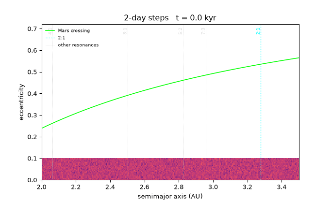

# Kirkwood gaps in the Sun–Jupiter restricted problem

A test-particle simulation of the asteroid belt's resonant structure, written as
a symplectic integrator and used as the vehicle for an HPC exercise: the same
physics on the CPU and on the GPU, measured and compared.

**[Watch it: 81 seconds, 4K](https://www.bilibili.com/video/BV16RHi6oE46/)** — a
million years of the belt, cut into four segments at four step sizes, from the
first thousand years to the last nine hundred thousand.

The answer it arrives at is that **the 3:1 and 5:2 gaps need two ingredients at
once, and neither works alone**: perturbers with eccentric orbits, which is what
makes the ν₅ and ν₆ secular resonances exist, and a removal mechanism, without
which the particles the resonances excite stay where they are.

## Results

The measure throughout is the **depletion ratio**: particles within ±0.025 AU of
a resonance at the end of a run, divided by the number there at the start.

All three at 0.3 Myr, 10⁵ particles, same seed, window ±0.025 AU:

| configuration | 2:1 | 3:1 | 5:2 | 4:1 | 7:3 |
|---|---|---|---|---|---|
| circular Jupiter + Saturn, no removal | 0.842 | 0.998 | 1.006 | 0.997 | 0.994 |
| eccentric Jupiter + Saturn, no removal | 0.888 | 0.991 | 1.008 | 0.998 | 1.007 |
| eccentric, **Mars-crossing removal** | 0.888 | **0.904** | **0.909** | 0.982 | 1.007 |

A window holds about 3285 particles, so 1σ is 1.7%.

Two things are worth more than the third decimal. The 4:1 and the 7:3 stay flat
in every configuration. And the 2:1 is unmoved by removal — its particles never
reach the Mars line — while the 3:1 and the 5:2 both open by about 9%. That is
the same split the literature draws between the Hecuba gap and the rest.

The baseline for these ratios excludes only particles that are Mars-crossing at
t = 0, of which there are none here. It does not exclude the ones that cross
later: those are exactly what the mechanism removed, and a denominator that
dropped them too would report 0.990 for the 3:1 and hide the effect entirely.

Two animated views of the (a, e) plane, one frame per stored snapshot:




The spikes that stand at every resonance line, well above the Mars-crossing
curve, are the population the removal step acts on. The structures grow over
roughly 3–7 × 10⁴ years and then stop moving.

## What the model is

- Sun, Jupiter, and optionally Saturn, on prescribed orbits about the origin.
  The perturbers feel the Sun only, so they do not pull on each other; this is
  the restricted problem, and it is enough for the secular resonances because the
  test particles feel every body.
- Massless, non-interacting test particles: 10⁵ of them, semimajor axis uniform
  on [2.0, 3.5] AU, eccentricity uniform on [0, e_max], every one placed at
  perihelion.
- Units are AU, day and M☉. `G` is folded per step, so velocities are AU per
  *step*, not per day. `dt` is a build option (`PH_DT`, default 10 days).
- Two integrators, picked at run time with the tenth argument or `--wh`. The
  default is a kick–drift–kick leapfrog composed into Yoshida's fourth-order
  scheme, S₂(w₁)S₂(w₀)S₂(w₁) with w₁ = 1.3512…, w₀ = −1.7024…; self-convergence
  measures order p = 4.00, against p = 1.98 for plain leapfrog as a control.
  The other is the Wisdom–Holman mapping: the drift becomes an exact Kepler
  advance, DKD, and the kick carries only the perturbers. Its step is limited by
  how fast the perturbation changes rather than by perihelion, which is worth
  about ten times the step for the same accuracy.
- Removal is **not** part of the integration. The test particles do not interact,
  so deleting one leaves every other trajectory untouched, which makes removal
  equivalent to screening the stored snapshots afterwards. Removing one from a
  trajectory costs seconds instead of another night of GPU time, and it is why
  the runs keep every particle.

## Layout

```
cpp/                    shared by both builds
  physics.hpp           units, constants, the perturbers' orbital elements
  body.hpp  vec3.hpp    Planet, and the SoA vector types
  setup.hpp             the perturbers and the initial draw
  args.hpp              the command line, and the one-line summary
  epoch_file.hpp        the epoch file: the only definition of the format
  kepler.hpp            exact two-body drift, for the Wisdom-Holman scheme
  simulation.hpp/.cpp   the CPU integrator, which is the reference
  main.cpp
cuda/
  gpu_simulation.hpp/.cu   the device half: kernels plus the owning class
  main.cu
python/                 reading and plotting only; never physics
  kirkwood_io.py
scripts/
  run_one.sh            one run, with resume, watchdog and slicing
  sweep.sh              a budgeted queue of runs
  ae_evolution.py       the two GIFs in docs/
  make_video.py         the video: four segments, four step sizes, one MP4
  render_frames.py      one epoch to one frame, PNG plus its histograms
  render_from_npz.py    the same frames redrawn from those histograms, any dpi
  render_4k.sh          drives the above over a whole video
tests/
  test_kepler.cpp       the drift, against answers known in closed form
analysis.ipynb          the analysis, top to bottom
```

`cpp/` and `cuda/` are deliberately not shared beyond the headers listed above.
The CPU integrator is the reference the GPU one is checked against, and keeping
them independent is what makes that check mean anything.

## Building

Needs a C++23 compiler, OpenMP, and optionally a CUDA toolkit. The CUDA targets
are guarded, so a machine without one still configures and builds the CPU
target.

```sh
cmake -S . -B build-o3 -DCMAKE_BUILD_TYPE=Release
cmake --build build-o3 -j
```

`CMAKE_CUDA_ARCHITECTURES` is pinned to `89` (Ada); change it in
`CMakeLists.txt` for a different card. Pinning embeds no PTX and keeps the build
fast at the cost of running only on that architecture.

## Running

Both binaries take the same arguments, so a run is reproduced by re-issuing its
command line against either:

```sh
./build-o3/kirkwood     <n_particles> <n_steps> [dump_dir] [epoch_every] \
                        [e_max] [saturn] [seed] [eccentric] [wisdom_holman]
./build-o3/kirkwood_gpu <same>
```

`cmake --build` produces one GPU binary per step size — `kirkwood_gpu` (10 days),
`_dt0p5`, `_dt2`, `_dt5`, `_dt20`, `_dt100`, `_dt200` — because the epoch format
stores velocities in AU per step, and a state written with one `dt` cannot be
read by a binary built with another without rescaling. A video segment uses the
step size that suits its span; the driver picks the ladder from the integrator.

Prefix a benchmark with `""` as `dump_dir`: the dumps share the wall clock with
the integration, so otherwise a timing run measures the disk.

For an unattended run, use the driver rather than the binary:

```sh
# one run, resumable, with a watchdog
nohup bash scripts/run_one.sh > data/run/driver.out 2>&1 &

# a queue of configurations, stopping when the time budget runs out
nohup bash scripts/sweep.sh > data/sweep/driver.out 2>&1 &
```

Both resume from the newest epoch file in the output directory, so a run
interrupted by a crash, a reboot or a slice boundary continues where it left
off. A run split this way produces output bit-identical to an uninterrupted one.

## Performance

Measured on the machine this was developed on, 10⁶ particles:

| | ns per particle per step |
|---|---|
| CPU, 4 OpenMP threads | 18.6 |
| GPU, Yoshida-4 | 0.83 |
| GPU, Wisdom–Holman | 4.09 |

The GPU port is one thread per particle for a whole outer step, with the
accumulator in a register and no barrier anywhere, and it passes the perturbers'
positions as a `BodyTable` by value so no device copy lands in the inner loop.
The force is computed in single precision: Nsight Compute put the FP64 pipeline
at 86.8 % with the issue slots at 2.3 %, and moving the force off that pipe was
worth 1.80×. Per-particle |Δa| after 10⁵ years rises from 1 × 10⁻¹⁴ to
5 × 10⁻⁴ AU as a result, which is 2 % of the 0.025 AU gap width; the quantity
actually measured is a density, and the difference is 30× smaller than the signal
in the worst bin.

Wisdom–Holman costs 4.5× more per step, because the Kepler solve is 14 force
evaluations' worth of arithmetic, but takes 10.8× larger steps: 2.4× faster
overall. The profile is unambiguous about where its cost is — ncu puts 97 % of
its cycles with no eligible warp, and every cycle it spends over the Yoshida
kernel is waiting on a MUFU result. The solve's `sin` and `cos` are serially
dependent through the Newton iteration and 8 warps per scheduler cannot hide
them.

The machines' own rates matter to two scripts — `scripts/run_one.sh` sets its
watchdog threshold from a measured pace, and `scripts/sweep.sh` decides what fits
in a budget from a rate table — and both say so where they are set.

## Licence

MIT. See `LICENSE`.
